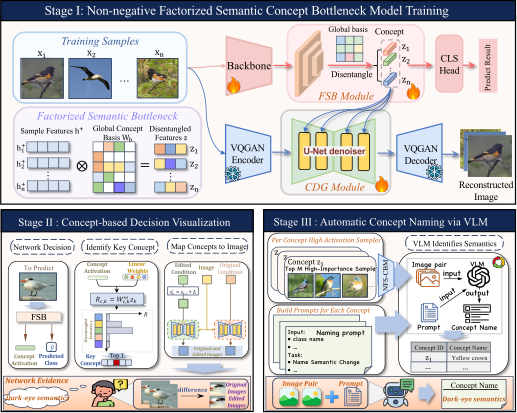
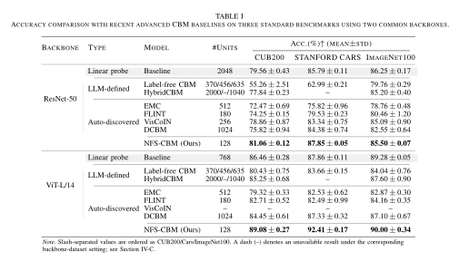

# NFS-CBM

---

Non-negative Factorized Concept Bottleneck Models for Automatic Concept Discovery with Generative Models

---

*This repository contains the partial PyTorch source of NFS-CBM.*

> **Abstract**
>
> NFS-CBM is an end-to-end concept bottleneck model for automatic concept discovery and generative visual explanation. Its Factorized Semantic Bottleneck uses non-negative concept activations and a decorrelated global basis to organize discriminative visual information into compact concept units. A concept-conditioned diffusion generator maps these concepts to image-space interventions. After training, a vision-language model summarizes consistent intervention effects and assigns readable semantic names to the discovered concepts.

> **Method overview**

> **Main results**
>
> NFS-CBM is evaluated on CUB-200-2011, Stanford Cars, and ImageNet-100 with ResNet-50 and ViT-L/14 backbones. The main accuracy comparison is shown below.

- [ ] **To-do list**
  - [x] Upload the partial PyTorch training entry
  - [x] Present the NFS-CBM method overview
  - [x] Present the main experimental results
  - [ ] Release the complete model implementation
  - [ ] Release the testing and evaluation code
  - [ ] Release the automatic concept-naming pipeline
  - [ ] Release configuration files and data preprocessing
  - [ ] Release checkpoint specifications and pretrained weights
  - [ ] Add complete installation and reproduction instructions

The remaining implementation will be released after publication.
