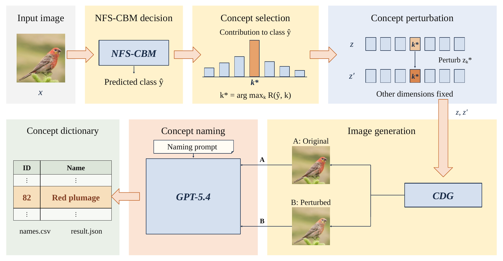
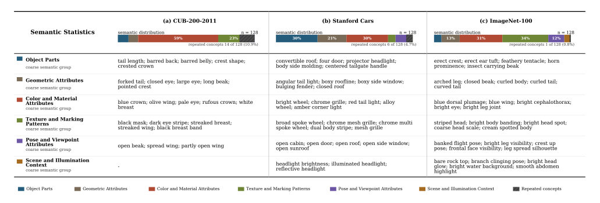

# Automatic concept naming pipeline

This pipeline is an auxiliary analysis tool for a trained NFS-CBM. It names all concept dimensions from the visual changes produced by concept perturbation.

## Pipeline



For every test image, the exported model returns class logits and the non-negative concept vector `z`. For each concept dimension `k`, the pipeline selects the `top_m` test samples with the largest `z[k]`. It reconstructs each selected image twice: once with the original vector and once after changing only `z[k]` by the configured perturbation. GPT-5.4 receives the paired reconstructions, dataset context, concept identifier, and fixed naming prompt. One structured result is written for every dimension.

## Required local inputs

The repository supplies the model interface and pipeline. The following files remain local:

```text
checkpoints/nfs_cbm_inference.pt
data/test/<class_name>/<image files>
```

The checkpoint path and dataset path are configured in `configs/naming_pipeline.json`. The example uses virtual paths and does not contain weights.

The checkpoint must be a TorchScript module with:

- `forward(images) -> (logits, concepts)`
- `reconstruct(images, concepts) -> reconstructed_images`

`model/nfs_cbm.py` provides the NFS-CBM inference wrapper, factorized semantic bottleneck, checkpoint export, and checkpoint validation. Pass the trained backbone and concept-conditioned diffusion generator into that wrapper before export.

## Run

```bash
python -m pip install -r requirements.txt
cp configs/naming_pipeline.example.json configs/naming_pipeline.json
export OPENAI_API_KEY="your_api_key"
python concept_naming/pipeline.py --config configs/naming_pipeline.json
```

Use `--dry-run` to load the model, scan the dataset, select samples, perturb every dimension, and generate all image pairs without sending requests to OpenAI:

```bash
python concept_naming/pipeline.py --config configs/naming_pipeline.json --dry-run
```

Use `--resume` to keep completed concept names when rerunning an interrupted job.

## Configuration

The example fixes GPT-5.4 snapshot `gpt-5.4-2026-03-05`, image detail `high`, reasoning effort `high`, five selected samples per dimension, and an additive perturbation of `1.0`. The manuscript defines `top_m` and the perturbation symbolically without reporting their numerical values. The example values are therefore configuration placeholders and must be replaced with the values used for the target checkpoint.

The perturbation value must match the setting used to produce the reported naming results. A negative value is accepted when the intended perturbation decreases the target dimension. The pipeline records the setting in `run_metadata.json`.

## Output

```text
outputs/concept_naming/
  concept_dictionary.csv
  concept_dictionary.json
  run_metadata.json
  pairs/
    concept_000/
      sample_01_original.png
      sample_01_perturbed.png
  responses/
    concept_000/
      result.json
      raw_response.json
      request_metadata.json
```

The dictionary contains every concept identifier, name, confidence value, definition, and supporting evidence. The image pairs remain the primary visual evidence.

## Full-run result

The following vector figure summarizes the completed naming run for all 128 concept dimensions on each benchmark.



## Scope

The pipeline performs inference, sample selection, concept perturbation, image generation, and post-hoc naming. It does not train NFS-CBM or download a checkpoint. The repository excludes weights by design.

The naming prompt follows Supplementary Material Section II. `appendix_prompt.txt` preserves the appendix wording. `prompt_template.txt` uses direction-neutral perturbation wording so the same code supports positive and negative changes.
