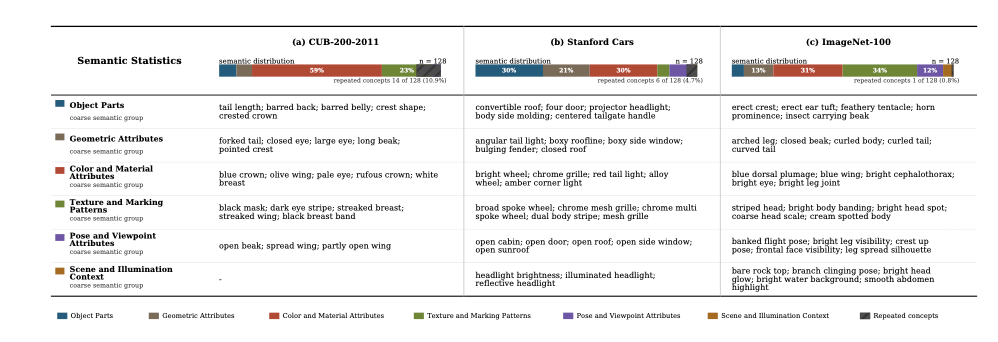

# NFS-CBM · Concept naming

This module implements the post-hoc naming procedure described in Section III-G of *Non-negative Factorized Concept Bottleneck Models for Automatic Concept Discovery with Generative Models*. GPT-5.4 compares a reconstruction with its perturbed counterpart and assigns a concise description to the visible change. Naming takes place after training. It does not change concept activations, class predictions, diffusion training, or the reported quantitative evaluations.


[Workflow PDF](workflow.pdf) · [Editable PowerPoint](workflow.pptx) · [Protocol](METHOD.md)

The diagram shows the full single-sample workflow: prediction, concept selection, perturbation, image generation and naming. The supplied script implements naming from the exported image pair. The preceding stages require the trained NFS-CBM implementation.

## Input

Each pair must contain two aligned images of the same sample:

| Input | Meaning |
| --- | --- |
| Image A | Reconstruction under the original concept condition |
| Image B | Reconstruction after perturbing one target concept dimension, with the remaining dimensions fixed |

Provide a concept identifier and dataset context with each pair. The predicted class can be supplied as contextual metadata. PNG, JPEG and WebP images are accepted. Pair dimensions must match. The script applies EXIF orientation, converts to RGB and encodes lossless PNG, preserving image dimensions and the full field of view. It does not perform registration, cropping, concept intervention or diffusion reconstruction.

For concept-level assessment, export the pairs for the selected high-activation samples and keep them in a fixed order. The paper specifies selection by concept activation but does not provide a numerical value for M. This release accepts the supplied selection and records its size; it does not infer M or rank samples from images.

## Setup

Use Python 3.10 or newer. Download this folder and run these commands from it:

```bash
python -m pip install -r requirements.txt
cp config.example.json config.local.json
```

Open `config.local.json` and paste an OpenAI API key into the empty `api_key` field. The default model is the fixed snapshot `gpt-5.4-2026-03-05`. The script calls the official OpenAI Responses API directly. API access and billing belong to the OpenAI project associated with the key.

`OPENAI_API_KEY` takes precedence over the configuration file. When neither contains a key, an interactive run asks for one with hidden input. Keep `config.local.json` local; the included ignore file excludes it from Git commits. No key is included in result files.

## Name one concept from one pair

Place the two images beside the script as `before.png` and `after.png`:

```bash
python name_concepts.py --before before.png --after after.png --concept-id concept_000 --dataset cub
```

Dataset identifiers are `cub`, `cars` and `imagenet100`. Supply `--dataset-context "Your dataset description"` for a different dataset. A predicted class can be included with `--predicted-class "Class name"`.

To check the images and request settings without sending data or incurring API charges:

```bash
python name_concepts.py --before before.png --after after.png --concept-id concept_000 --dataset cub --dry-run
```

A single pair produces a sample-conditioned description. Use several pairs to assess whether the change recurs across samples.

## Name concepts across samples

Copy `manifest.example.json` to `manifest.json`. Replace the example paths with your exported reconstruction pairs. Use one entry per concept, and list that concept's selected samples under `pairs`. Image paths are relative to the manifest file. Each pair can include a `predicted_class` string.

```bash
python name_concepts.py --manifest manifest.json --output runs --resume
```

The script sends one request per concept, containing every listed A–B pair. The fixed naming prompt uses direction-neutral perturbation wording. The verbatim appendix prompt is preserved in `appendix_prompt.txt`. A separate [multi-sample instruction](multisample_instruction.txt) asks the model to identify recurring changes, cite supporting pair numbers and record inconsistent effects. The request limit is 20 pairs per concept and 45 MiB after encoding. These are implementation limits, not experimental hyperparameters.

## Output

| File | Content |
| --- | --- |
| `names.csv` | Concept names, confidence, pair counts and evidence |
| `names.md` | Readable summary of completed concepts in the current run |
| `result.json` | Full naming result and provenance for one concept |
| `request_metadata.json` | Exact prompt text, image checksums and inference settings |
| `raw_response.json` | Unmodified API response |

Each concept has its own directory inside `runs`, identified by its concept identifier and request checksum. The JSON result follows the appendix fields: `best_name`, `candidate_names`, `visual_changes`, `main_changed_part`, `main_attribute`, `definition`, `supporting_evidence`, `ignored_incidental_changes`, `confidence` and `uncertainty`, together with `concept_id`.

`--resume` reuses completed results only when the request checksum matches. Changing an image, its order, the prompt or inference settings creates a different result directory. Preserve the input files with the outputs to retain the complete evidence.

## Reproducibility

The release fixes the model snapshot, prompt and image order. Requests use reasoning effort `none`, temperature `0` and strict JSON output. The archive records the requested and returned model identifiers, API request and response identifiers, timestamps, token usage, image checksums and the full text submitted to the model. These settings support traceable reruns; they do not guarantee identical responses from a hosted model.

The supplied manuscript identifies GPT-5.4 but does not specify its historical snapshot or decoding settings. The fixed snapshot and decoding parameters here are documented release defaults. The execution prompt generalizes the appendix's positive increase to a perturbation of one concept dimension; it names the observed change without assuming that an attribute becomes stronger. The multi-sample instruction is an explicit implementation of the manuscript's cross-sample assessment; it is not presented as text quoted from the appendix.

Run the offline checks with:

```bash
python -m unittest -v test_naming.py
```

These checks exercise image preparation, request construction, response handling and cached reruns with simulated API responses. They do not call OpenAI. A live naming run requires your API key and actual reconstruction pairs.

## Semantic statistics reported in the manuscript



The supplied manuscript figure summarizes VLM-assigned names for 128 concept units per dataset. It groups descriptors into object parts, geometric attributes, color and material attributes, texture and marking patterns, pose and viewpoint attributes, and scene and illumination context. Reported repeated-concept counts are 14 on CUB-200-2011, 6 on Stanford Cars and 1 on ImageNet-100.

This is the authors' supplied result figure, corresponding to Fig. 7 of the supplied manuscript. It is not a new output of this release. The figure is an aggregate display; individual naming records and original API responses are not included. Names serve as semantic summaries, with the intervention pairs remaining the primary visual evidence.

## Release scope

This folder contains the naming script, configuration template, naming prompt, archived appendix prompt, multi-sample instruction, input manifest, offline checks, workflow and supplied result figure. Training, quantitative evaluation, image generation, checkpoints and a local open-source VLM implementation are outside this release. This folder alone does not reproduce the main experimental tables.

## References

- Main manuscript, Section III-G: post-hoc semantic assessment and naming; Fig. 7: semantic statistics.
- Supplementary Material, Section II: fixed prompt template.
- [OpenAI GPT-5.4 model documentation](https://developers.openai.com/api/docs/models/gpt-5.4)
- [OpenAI image inputs](https://developers.openai.com/api/docs/guides/images-vision)
- [OpenAI structured outputs](https://developers.openai.com/api/docs/guides/structured-outputs)
- [GPT-5.4 parameter compatibility](https://developers.openai.com/api/docs/guides/latest-model?model=gpt-5.4)
